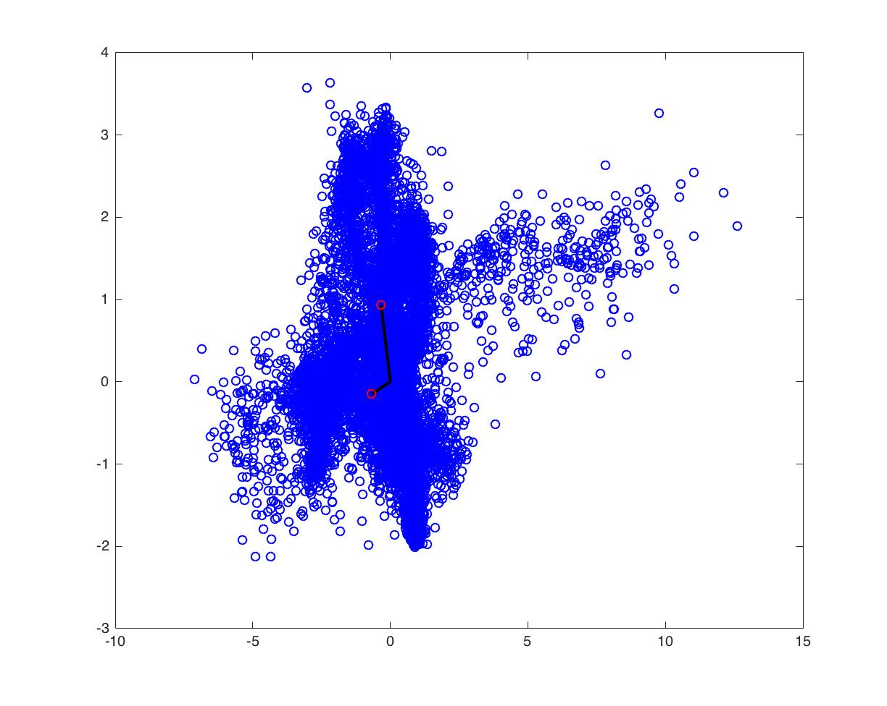

## A balanced life
Nowadays, people consider their health issues more and
more importantly. Within the development of technology, we can record our physical traits timely and easily. However, there are still rooms to improve
the accuracy and different types of data we could collect. One thing I would like to propose here is to measure the balance issue when people are walking
or running on the street.

## Low dimensional projection of IMU data by PCA

* This figure shows it's reasonable to use PCA to reduce
the dimension.

## In-toeing walk captured by PCA

* This figure shows that the forces the first subject undergone was inward, we may consider as in-toeing walk

## Impact
* Next generation of foot wear product such as socks, shoes
* Prevent further severe problems caused by unbalanced issue

## About Po-Yao

* Math Guru
* Heavy metal maniac